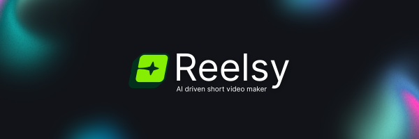

<div align="center">



An AI-powered short video generator built with **Next.js** + **React**, using **Convex** for real-time database management and **Inngest** for asynchronous background jobs.

 
 
 
 
 

 
 
 
 


</div>

---
## Contents

- [Getting Started](#getting-started)
- [Convex Setup (Local)](#convex-setup-local)
- [Inngest Setup (Local)](#inngest-setup-local)
- [Running the App](#running-the-app)
- [Project Structure](#project-structure)
- [Environment Variables](#environment-variables)
- [How to Contribute](#how-to-contribute)
- [License](#license)


---

## Architecture


```elixir
├── app/                # Next.js App Router
├── convex/             # Convex functions and schema
├── inngest/            # Inngest functions and event handlers
├── public/             # Assets (e.g., fonts, clips)
├── .env                # Environment variables (for Remotion and GCP)
└── .env.local          # Environment variables (for Firebase, Convex,OpenAI, Deepgram Replicate)
```

---

## Getting Started

### 1. Clone the Repository

```bash
git clone https://github.com/dipyamanroy/reelsy.git
cd reelsy
```

### 2. Install Dependencies

```bash
npm install
# or
yarn install
```

---

## Convex Setup (Local)

Convex is used to handle real-time database operations.

### Prerequisites:
- Install [Docker](https://docker.com/).
- Install [Convex CLI](https://docs.convex.dev/cli):

```bash
npm install -g convex
```

### Start local Convex docker instance
```bash
docker compose up
```

### Start Convex dev server
```bash
npx convex dev
```

This will:
- Start a local Convex docker instance
- Generate a `.env.local` file with your local Convex credentials
- Start Convex dev server at [http://localhost:6791](http://localhost:6791)

Make sure to include `convex/` and `.env.local` in your `.gitignore`.

>[!NOTE]
Convex dev server will hot-reload when you edit `schema.js` or backend functions.

---

## Inngest Setup (Local)

Inngest is used for asynchronous backround jobs.

### Prerequisites:
- Install the [Inngest CLI](https://www.inngest.com/docs/cli):

```bash
npm install -g inngest
```

### Initialize and Start Inngest Dev Server

> [!TIP]
Run Convex and Inngest dev servers in **separate terminals** alongside `npm run dev`.

```bash
npx inngest-cli@latest dev
```

This will:
- Watch events and functions under `/inngest/`
- Route background jobs locally at [http://localhost:8288](http://localhost:8288)

---

## Running the App

### Start the Next.js Dev Server

```bash
npm run dev
```

Visit [http://localhost:3000](http://localhost:3000) to see your app in action.

---
## Environment Variables
#### Firebase
Reelsy persists speech audio and images in Firebase. You must create a Web App API key in Firebase. Follow the guide [here](https://firebase.google.com/docs/projects/api-keys).

#### OpenAI
Reelsy need OpenAI for script and tts generation. Ensure you have access to `gpt-4o-mini`/`gpt-4o` and `gpt-4o-mini-tts`.  You can find your OpenAI API key [here](https://platform.openai.com/api-keys).

#### Deepgram
Reelsy needs Deepgram to generate caption timestamps from speech audio. You must create a Web App API key in Firebase. Follow the guide [here](https://developers.deepgram.com/docs/create-additional-api-keys).

#### Replicate
Reelsy needs Replicate to generate images to be used in the video. Create an account and find your key [here](replicate.com/account/api-tokens).

You will need to set the following in `.env.local`:

```env
NEXT_PUBLIC_FIREBASE_API_KEY=...
NEXT_PUBLIC_CONVEX_URL=...              # Auto generated (or localhost)
OPENAI_API_KEY=...
NEXT_PUBLIC_DEEPGRAM_API_KEY=...
REPLICATE_API_TOKEN=...
```

You will need to set the following in `.env`:


#### Remotion Cloudrun and GCP
To perform [SSR](https://www.remotion.dev/docs/ssr) with Remotion Cloudrun and GCP, follow the guide [here](https://www.remotion.dev/docs/cloudrun/setup).
```env
REMOTION_GCP_PRIVATE_KEY=...
REMOTION_GCP_CLIENT_EMAIL=...
REMOTION_GCP_PROJECT_ID=...
GCP_SERVICE_URL=...
GCP_SERVE_URL=...
```

> [!IMPORTANT]
Follow the Remotion Cloudrun guide for the "Export and Download" functionality to be active.
---

## How to Contribute

We welcome contributions to Reelsy! Here are some guidelines to help you get started:

### 1. Fork the Repository

- Start by forking the repository by clicking the **Fork** button at the top-right of the page.

### 2. Clone the Forked Repository

- After forking, clone your forked repository to your local machine:

```bash
git clone https://github.com/your-username/reelsy.git
cd reelsy
```

### 3. Create a New Branch

Before making any changes, create a new branch for your work:

```bash
git checkout -b your-feature-branch
```

Choose a descriptive name for your branch based on the feature or fix you're working on.

### 4. Make Your Changes

Make the necessary changes or additions to the codebase.


### 5. Test Your Changes

Test your changes locally to ensure everything is working as expected.

If applicable, add tests to ensure your changes are covered.

### 6. Commit Your Changes

After making your changes, commit them to your branch:

```bash
git add .
git commit -m "Add a brief description of your changes"
```

> [!IMPORTANT]
Be sure to write clear, concise commit messages that describe the changes you're making. Ref. [Conventional Commit Messages Cheatsheet](https://gist.github.com/qoomon/5dfcdf8eec66a051ecd85625518cfd13).

### 7. Push to Your Fork

Push your changes to your forked repository:

```
git push origin your-feature-branch
```

### 8. Open a Pull Request

Go to the original repository on GitHub and click on Compare & pull request.

Provide a detailed description of the changes in your pull request.
Make sure to explain why the changes are needed and what impact they will have.

### 9. Get Feedback

The maintainers will review your pull request. Be open to feedback and make necessary changes.

If changes are requested, modify your code and push the updates to your branch.


## License
This project is licensed under GPL v3. Find the full license here [LICENSE](LICENSE).